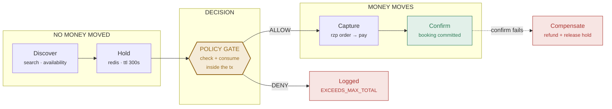

# Café De Agentic Layer

**Razorpay AI Buildathon · Track 01 — AI Growth & Agentic Commerce**

A mandate-gated agentic commerce layer on top of an existing café booking platform. The thesis: **perishable, capacity-constrained inventory is the hard case for AI buyers** — and Café De already owns the primitive that makes it tractable.

| | |
|---|---|
| **Substrate** | NestJS · Postgres · Redis |
| **Build window** | 3 days |
| **Payments** | Razorpay test mode |
| **Unit of account** | paise (integer) |

---

## Contents

**Position** — [§01 The thesis](#01--the-thesis) · [§02 Bar coverage](#02--bar-coverage) · [§03 Repo & provenance](#03--repo--provenance)

**Architecture** — [§04 The money path](#04--the-money-path) · [§05 Mandate](#05--mandate) · [§06 The policy gate](#06--the-policy-gate) · [§07 Decision log](#07--decision-log)

**Integration** — [§08 Razorpay test mode](#08--razorpay-test-mode) · [§09 Agent surface](#09--agent-surface) · [§10 Revenue mechanic](#10--revenue-mechanic)

**Evidence** — [§11 Batch harness](#11--batch-harness) · [§12 3-day plan](#12--3-day-plan) · [§13 Video script](#13--video-script) · [§14 Panel defence](#14--panel-defence)

---

## §01 · The thesis

> Say this in the first fifteen seconds of the pitch. It is the thing that separates this submission from a chatbot over a product list.

Every agentic commerce protocol shipping right now — AP2, the agentic checkout specs, the card-network agent rails — implicitly assumes **infinite-stock SKUs and a simple add-to-cart**. They handle the case where an agent proposes a purchase and a human approves it three minutes later by simply… retrying the cart.

That model breaks on perishable inventory. A 7pm table tonight either sells or is destroyed at 7pm. You cannot let an agent hold it indefinitely while it waits for a human, and you cannot let it evaporate the moment the agent stops typing. You need **capacity held under a TTL, converted atomically on payment, and released on failure**.

Café De already has that primitive. Restaurants, salons, clinics, events and travel are the same shape, and it is a very large slice of Indian merchant GMV that current agent rails serve badly.

**The pitch:** making perishable-inventory merchants transactable by AI buyers.

---

## §02 · Bar coverage

Razorpay's stated bar for Track 01:

> *"Every money action explainable, bounded and gated. Show the audit trail and one failure handled gracefully."*

Each clause, against what the codebase already does.

| Clause | Status | Mechanism |
|---|---|---|
| **Gated** | `HAVE` | Agent already pauses for human approval before spending. Upgrade from per-action prompt to a signed standing mandate. |
| **Failure handled gracefully** | `HAVE` | Agent compensates — releases its holds — when a step fails. Extend to issue a Razorpay refund when capture succeeded but confirm failed. |
| **Audit trail** | `PARTIAL` | Transactional outbox exists for bookings. Add an `agent_decision` log beside it so *refusals* are recorded, not just successes. |
| **Safe under agent retry** | `HAVE` | Idempotency keys on confirm + partial unique index. Agents retry constantly; this is why most submissions will double-book on day two. |
| **Bounded** | `BUILD` | No spend ceiling exists today. Mandate with atomic check-and-consume — §05, §06. |
| **On Razorpay test APIs** | `BUILD` | The ₹500 wallet is play money. Replace the debit with Orders + Payments + webhook — §08. |
| **Readable by AI buyers** | `BUILD` | Five booking tools exist but only for the first-party agent. Expose them over MCP + a discovery doc — §09. |
| **Grows merchant revenue** | `BUILD` | Zero upsell mechanics today. This is half the track title and the biggest real gap — §10. |

Four of eight already satisfied by architecture built for other reasons. **That ratio is the whole reason Track 01 is viable in three days.**

---

## §03 · Repo & provenance

How to present pre-existing work without either hiding it or burying the new work in it.

New repository, `cafe-de-agentic-commerce`. First commit imports the existing application as the declared substrate, with a link back to the original. Everything after that is real buildathon work with real timestamps.

Put this at the top of the README, above the fold:

```markdown
## What this is

Agentic commerce layer for perishable inventory, built on Café De —
a café table-booking platform I built previously (original repo: …).

### Substrate (pre-existing)
Booking core · Redis holds w/ TTL · idempotent confirm · transactional
outbox · saga compensation · partner API keys & webhooks

### Built for this buildathon
Mandate & policy gate · Razorpay test-mode payments · agent decision
log · MCP agent surface · slot-fill revenue agent · evaluation harness

All buildathon commits are dated within the contest window.
```

> **Why this is the stronger play**
>
> "I already had a production-grade booking core and built the agentic layer on top in three days" is more credible *and* more impressive than "I built all of this in three days" — which invites exactly the scrutiny you'd be trying to avoid. The prior work is the moat; it's the reason you can attempt this track when others can't. Label it and let it work for you.

---

## §04 · The money path

Six steps. The only one that matters architecturally is the third.



Every transition writes one `agent_decision` row — **including the denials**.

Note where the gate sits: **after** the hold, **before** the Razorpay order. Holding capacity costs the merchant nothing recoverable and costs the buyer nothing, so it should not consume mandate budget. Creating a payment intent is the first irreversible-ish act, so that's the checkpoint.

---

## §05 · Mandate

The human's grant of bounded authority to an agent. This is the object that makes "bounded" real rather than a prompt instruction the model can talk itself out of.

```ts
// apps/api/src/mandate/mandate.entity.ts

export interface Mandate {
  id:            string;
  userId:        string;         // the human who granted it
  agentId:       string;         // which agent holds it (= api key subject)
  status:        'ACTIVE' | 'EXHAUSTED' | 'REVOKED' | 'EXPIRED';

  // --- constraints: immutable once signed ---
  maxPerBookingMinor: number;    // paise, e.g. 60000 = ₹600
  maxTotalMinor:      number;
  maxBookings:        number;
  allowedLocalities:  string[];  // ['Hauz Khas','GK-II']
  windowStart:        Date;      // booking must fall inside
  windowEnd:          Date;

  // --- consumption: mutated ONLY inside the booking tx ---
  consumedMinor:    number;
  consumedBookings: number;

  expiresAt: Date;
  revokedAt: Date | null;
  signature: string;  // HMAC-SHA256(constraints, SERVER_SECRET)
}                     // → non-repudiation: proves the human
                      //   authorised THESE bounds, not others
```

### Three decisions worth defending

- **Amounts are integer paise, never floats.** ₹600 is `60000`. Razorpay's API takes paise anyway, so this removes a whole class of rounding bug at the boundary.
- **Constraints and consumption are separate.** Constraints are signed and frozen; consumption is hot and transactional. Mixing them means every spend invalidates the signature.
- **The signature is the consent record.** When the panel asks "where is the human in the loop?", the answer is not "there's a confirm dialog" — it's "here is a signed artifact, timestamped, naming the exact bounds the human agreed to, replayable from the audit log."

---

## §06 · The policy gate

The single highest-value 40 lines in the submission. Get this right and the architecture defence writes itself.

> ### ⚠ The trap
>
> The obvious implementation is a NestJS guard or interceptor that checks the mandate before the handler runs. **That is wrong and it is exploitable.**
>
> Two concurrent agent requests both read `consumedMinor = 40000` against a `maxTotalMinor` of `60000`, both see ₹200 of headroom, both pass the guard, and both spend. The mandate is breached by an agent that did nothing unusual — it just retried in parallel, which is exactly what agents do.

The check and the spend must be the same atomic operation. Do it as a conditional `UPDATE` inside the booking transaction and let the row count be the verdict:

```sql
-- mandate.service.ts · authorizeAndConsume()  [inside tx]

UPDATE mandate
   SET consumed_minor    = consumed_minor + $amount,
       consumed_bookings = consumed_bookings + 1
 WHERE id = $mandateId
   AND status = 'ACTIVE'
   AND expires_at > now()
   -- the ceilings, evaluated atomically with the write
   AND consumed_minor + $amount <= max_total_minor
   AND consumed_bookings + 1    <= max_bookings
   AND $amount    <= max_per_booking_minor
   AND $locality  = ANY(allowed_localities)
   AND $slotStart BETWEEN window_start AND window_end
RETURNING consumed_minor, consumed_bookings;

-- 0 rows returned  → DENY. Roll back, log the refusal.
-- 1 row  returned  → ALLOW, and the budget is already spent.
```

No read-then-write. No advisory lock. No race. The database is the arbiter, and the verdict and the accounting happen in the same statement.

### Three verdicts, not two

`ALLOW` and `DENY` aren't sufficient. Add `REQUIRES_HUMAN` for the band between "clearly inside the mandate" and "clearly outside it" — a booking above a step-up threshold, or the last booking that would exhaust the mandate. That escalation path is what turns a blunt spend cap into something a merchant would actually switch on.

---

## §07 · Decision log

The audit trail requirement. The important property: it records what the agent *wanted*, not only what it got.

```
-- agent_decision  [written in the same tx as the outbox]

id                uuid
mandate_id        uuid
agent_id          text
user_id           uuid
step              DISCOVER|PROPOSE|AUTHORIZE|CAPTURE|CONFIRM|COMPENSATE
proposed_action   jsonb   -- what the agent asked to do
verdict           ALLOW|DENY|REQUIRES_HUMAN
deny_reason       text    -- EXCEEDS_MAX_TOTAL, LOCALITY_NOT_ALLOWED…
constraints_snap  jsonb   -- mandate state at decision time
idempotency_key   text
razorpay_order_id text
razorpay_pay_id   text
hold_id           text
latency_ms        int
created_at        timestamptz
```

Most submissions will log successful bookings. Logging **refusals with the constraint snapshot that caused them** is what makes the trail explainable — you can replay any decision and show why the system said no, using the mandate state as it stood at that instant rather than as it stands now.

Build one read endpoint on top: `GET /agent/decisions?mandateId=…` returning the ordered trace. **That endpoint is your audit-trail demo in the video.**

---

## §08 · Razorpay test mode

Replacing the ₹500 wallet. Keep the wallet behind an env switch so the demo still runs if the network dies mid-recording.

| Step | Call | Note |
|---|---|---|
| **Create order** | `orders.create({ amount, currency:'INR', receipt, notes })` | `amount` in paise. Put `mandateId` and `agentId` in `notes` — they come back on the webhook and close the loop. |
| **Pay** | test card `4111 1111 1111 1111` | Checkout, or the S2S test flow for a headless agent run. |
| **Webhook** | `payment.captured` | Verify `x-razorpay-signature` = HMAC-SHA256 of the **raw** body. Parse after verifying, never before. |
| **Confirm** | tx: booking + mandate + decision + outbox | One transaction. Unique index on `razorpay_pay_id` — Razorpay redelivers webhooks. |
| **Compensate** | `payments.refund(payId, { amount })` | Capture succeeded, confirm failed → refund and release the hold. This is your graceful-failure demo. |

> **The one that catches people**
>
> The webhook is the source of truth for payment, **not the client callback**. A browser callback can be dropped, replayed, or forged; the signed webhook cannot. Say this out loud in the panel — it's a small thing that signals you've shipped payments before.

**NestJS specifics:** register the webhook route with a raw-body parser (`rawBody: true` in `NestFactory.create`), because `express.json()` destroys the exact bytes the signature is computed over.

---

## §09 · Agent surface

"Sellable to AI buyers" stops being a claim the moment a third-party agent transacts against you. This is the demo everybody remembers.

Your five booking tools already exist and the agent is already "just another API client" — so wrapping them in an MCP server is mostly plumbing, and it converts your first-party agent into *any* agent.

```
MCP tool surface
auth: API key = agent identity · mandate = human authority

search_cafes(locality, partySize, date)
  → [{ cafeId, name, locality, geo, priceBandMinor }]

get_availability(cafeId, date)
  → [{ slotId, startsAt, capacity, priceMinor, demandScore }]

create_hold(slotId, partySize, mandateId, idempotencyKey)
  → { holdId, expiresAt, quotedPriceMinor }        // free action

create_payment_intent(holdId, mandateId)           // ← GATE FIRES HERE
  → { razorpayOrderId, amountMinor, checkoutUrl }
  → or { verdict:'DENY', reason:'EXCEEDS_MAX_TOTAL', remainingMinor }

confirm_booking(holdId, paymentId, idempotencyKey)
  → { bookingId, status }

cancel_hold(holdId)                                // compensation path

get_mandate_status(mandateId)                      // self-regulation
  → { remainingMinor, remainingBookings, expiresAt }
```

`get_mandate_status` looks minor and isn't. It lets a well-behaved agent check its own headroom before proposing, instead of discovering the ceiling by being refused. **Good agent APIs make compliance cheaper than violation.**

### Discovery

Serve `/.well-known/agent-commerce.json` — merchant identity, catalog endpoint, currency, MCP endpoint, auth scheme, mandate-grant URL. Half a page of JSON, and it's the concrete artifact behind "agent-readable catalog." Cheap; cut it only if you're behind.

---

## §10 · Revenue mechanic

Half the track title is "grow the merchant's revenue." One mechanic, chosen because perishable inventory makes it obviously correct.

**Dynamic slot-fill.** A slot unsold at start time is worth exactly ₹0 to the café — so any revenue above marginal cost beats letting it expire. When the requested slot is unavailable, *or* a low-demand slot exists inside the buyer's window, the agent proposes an alternative with a nudge: a discount on a cold slot, or a free upgrade to a larger table.

```
demandScore(cafeId, dayOfWeek, hourBucket)   // 0 = cold, 1 = hot

historical_fill_rate(cafe, dow, hour)   // 0..1, from bookings
  × 0.7
+ current_hold_pressure(slot)           // holds / capacity
  × 0.3

// cold slot (< 0.35) → eligible for a nudge
nudgeMinor = min(0.20 × priceMinor, maxDiscountMinor)
```

### Guardrails — say these before you're asked

- An alternative that violates the mandate is **never proposed**, not proposed-then-refused. The gate is the backstop; the agent shouldn't be reaching it on its own suggestions.
- Cap at two alternatives per request. An agent that keeps counter-offering is spam with extra steps.
- Discounts have a floor, set by the café owner, and never apply to already-hot slots — otherwise you've built a margin-destruction machine and called it growth.

---

## §11 · Batch harness

Track 01's structural weakness is that you cannot prove value. Perishable inventory is how you escape it — fill rate is a real, checkable number.

Generate 50–100 synthetic buyer intents from a fixed seed, then run **the same demand** through two arms:

- **Arm A — baseline.** Exact-match only. Requested slot unavailable → no booking.
- **Arm B — agent.** Slot-fill mechanic active, all actions mandate-gated.

| Metric | Why it's in the table |
|---|---|
| `slot_fill_rate` | The merchant-side outcome. Perishable inventory's core KPI. |
| `gross_revenue_minor` | Headline number. Report A and B, and the delta. |
| `revenue_per_slot` | Guards against "filled everything by discounting to zero." |
| `mandate_denials` | Grouped by reason. Proves the gate fires under load. |
| `over_refusal_rate` | Legitimate bookings blocked. **Your false-positive cost — nobody else will report this.** |
| `compensations_ok` | Injected failures that refunded *and* released cleanly. |
| `double_bookings` | Must be 0 under concurrent retry. Assert it in a test. |

Inject failures deliberately: force `confirm` to throw after a successful capture on ~5% of runs, then assert a refund was issued and the hold released. Write it as a test, not a demo script — `expect(compensations.failed).toBe(0)` is worth more than any slide.

> **Be honest in the writeup**
>
> State plainly that both arms share the same synthetic demand seed, and that the harness decides outcomes. Naming your own methodology's limits is a credibility multiplier in front of a panel — and they will spot it whether or not you mention it first.

---

## §12 · 3-day plan

Ordered so that if you run out of time, what's missing is polish rather than the thesis.

### D1 — Sep 3 · Money and bounds

- [ ] Razorpay test mode: order creation, checkout, signed webhook, raw-body parser
- [ ] Swap the wallet debit behind `PAYMENT_PROVIDER=wallet|razorpay`
- [ ] `mandate` table + grant endpoint + HMAC signing
- [ ] `authorizeAndConsume()` as the conditional UPDATE — with a concurrency test

**Ship:** an agent books a café with real test-mode money, and a mandate breach is refused under parallel load.

### D2 — Sep 4 · Agent surface and revenue

- [ ] MCP server wrapping the seven tools; API-key auth carried through
- [ ] `agent_decision` log + `GET /agent/decisions`
- [ ] `demandScore` + slot-fill proposals with guardrails
- [ ] Refund-and-release compensation path

**Ship:** Claude Desktop, as an external agent, discovers a café and completes a booking.

### D3 — Sep 5 · Evidence and delivery

- [ ] Batch harness, both arms, metrics to JSON + README table
- [ ] `.well-known/agent-commerce.json`
- [ ] README: thesis, substrate/new split, architecture, numbers
- [ ] **Record the video by 4pm.** Reserve the block; do not let it be the thing that slips

**Ship:** submitted with numbers, not adjectives.

### Cut lines, in the order you're allowed to cut

1. `.well-known` discovery doc — the MCP server carries the point alone
2. Frontend polish. Judges are reading the repo and watching the video, not using your UI
3. `REQUIRES_HUMAN` step-up band — ship binary allow/deny

**Never cut:** the mandate-denial demo, the compensation demo, or the batch numbers. Those three *are* the submission.

---

## §13 · Video script

Five minutes, timed. Most submissions spend four minutes on a happy path. **Spend ninety seconds on failure instead** — that's the differentiator.

| Time | Beat |
|---|---|
| `0:00` | **Thesis.** Agent rails assume infinite stock. A 7pm table is destroyed at 7pm. Here's what that changes. |
| `0:30` | **Grant the mandate.** Human sets ₹600/booking, ₹1,500 total, Hauz Khas, this week. Show the signature. |
| `1:00` | **External agent.** Claude Desktop — *not your own UI* — discovers cafés over MCP and proposes a booking. |
| `1:45` | **Gate → pay → confirm.** Hold, gate allows, Razorpay test capture, webhook, booking commits atomically. |
| `2:30` | **Upsell.** Requested slot full; agent proposes a cold slot at a nudge price. Fill rate moves. |
| `3:00` | **Refusal.** Agent attempts a ₹900 booking. Gate denies, `EXCEEDS_MAX_PER_BOOKING`, logged with the snapshot. |
| `3:40` | **Failure.** Capture succeeds, confirm throws. Refund issued, hold released, trail shows all six steps. |
| `4:20` | **Numbers.** Batch table: fill rate, revenue delta, denials by reason, over-refusal rate, 0 double-bookings. |
| `4:50` | **Close.** What was substrate, what was built this week, what ships next. |

---

## §14 · Panel defence

The questions this architecture invites. Have the answer ready in one breath each.

<details>
<summary><b>Why is the gate inside the transaction instead of middleware?</b></summary>

Because a read-then-write check is racy, and agents retry in parallel by nature. Two concurrent requests both read the same headroom and both pass. Making it a conditional `UPDATE` means the ceiling check and the budget spend are the same atomic statement — zero rows returned is the denial.
</details>

<details>
<summary><b>What stops the agent double-booking when it retries?</b></summary>

Idempotency key on confirm, plus a partial unique index on the slot so two bookings can't exist for the same seat, plus a unique index on `razorpay_pay_id` because Razorpay redelivers webhooks. Three layers, because agent retries hit all three paths.
</details>

<details>
<summary><b>Where exactly is the human in the loop?</b></summary>

At mandate grant — a signed artifact naming the exact bounds, timestamped, replayable from the decision log. Plus a step-up escalation for anything in the ambiguous band. The consent is a record, not a dialog box.
</details>

<details>
<summary><b>Is a table reservation really commerce?</b></summary>

It's the harder half of commerce. Perishable, capacity-constrained inventory can't be modelled as add-to-cart, which is why current agent protocols handle it badly. Restaurants, salons, clinics, events and travel are all this shape, and it's a large slice of Indian merchant GMV.
</details>

<details>
<summary><b>What's your false-positive cost here?</b></summary>

Over-refusal — legitimate bookings the mandate blocked. It's in the batch table. A gate tuned so tight that it refuses real demand costs the merchant exactly as much as no gate at all, just less visibly.
</details>

<details>
<summary><b>What existed before this week, and what didn't?</b></summary>

Substrate: booking core, Redis holds, idempotent confirm, outbox, compensation, partner keys. Built this week: mandate and gate, Razorpay integration, decision log, MCP surface, slot-fill agent, harness. It's split in the README and visible in the commit history.
</details>

<details>
<summary><b>What breaks first at scale?</b></summary>

The mandate row becomes a write hotspot — every booking under one mandate serialises on it. Fine at demo scale; at real volume you'd shard consumption into an append-only ledger and aggregate, trading the atomic ceiling for a reservation pattern. Worth naming before they ask.
</details>

---

*Café De × Razorpay Buildathon · Track 01 — substrate: NestJS · Postgres · Redis · Razorpay test mode*
