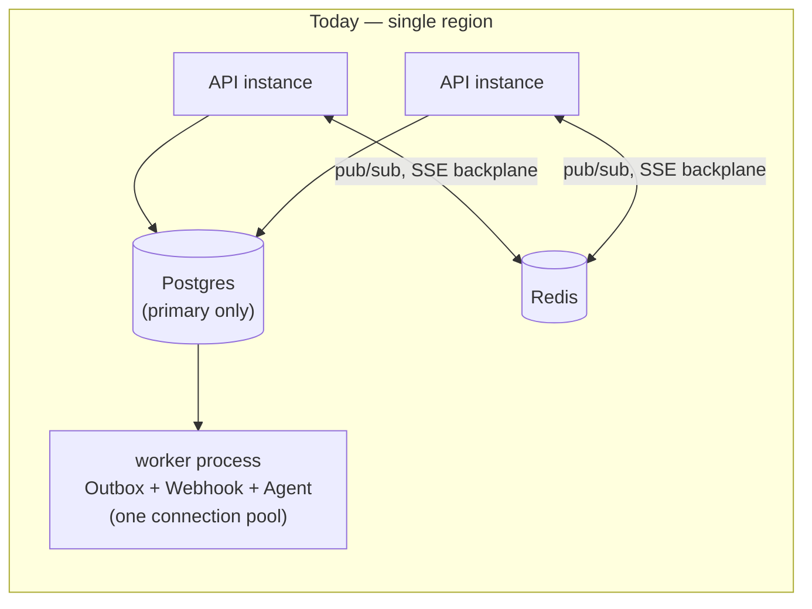
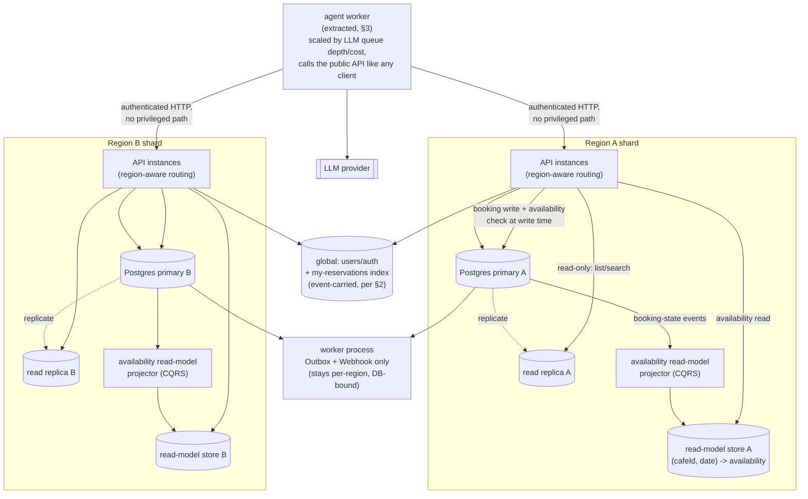

# M7 — Scale to N regions / N× load (design only, no code)

Roadmap M7 (`Roadmap.md`, "M7 — Scale to N regions / N× load `[DESIGN only]`"), PRD area
"Scale to N regions/N× load" (`#1`, non-functional requirement "Hundreds → hundreds of
thousands of users; regional sharding; read scaling — **[DESIGN]**"). Per the project's
BUILD/DESIGN convention this is a whiteboard artifact — nothing in this document is
implemented, and nothing here should be implemented without a Roadmap decision to promote it
to BUILD. Every claim below is grounded in this repo's actual M0–M6 code (file paths cited
throughout) rather than a hypothetical greenfield design, and every section answers exactly
one of the four interview questions Roadmap M7 names (mapping table at the end).

## Where this starts: the system as it exists today

- One Postgres (source of truth for `cafes`/`tables`/`slots`/`reservations`/... ,
  `apps/api/src/config/typeorm.config.ts`), one Redis (holds TTL, cache-aside, and the M4
  pub/sub SSE backplane, `apps/api/src/redis/`).
- N stateless API instances behind a load balancer — already horizontally scaled today,
  because M4 built the Redis pub/sub backplane precisely so a booking committed on instance A
  reaches an `EventSource` client on instance B (`apps/api/src/realtime/availability-events.service.ts`).
- One worker process (`apps/api/src/worker/main.ts`) running three independent pollers in the
  same Node event loop against the same Postgres connection pool: `OutboxWorkerService`
  (notifications, M3/#6), `WebhookWorkerService` (partner webhooks, #24), and
  `AgentWorkerService` (agent workflows, M5/#9/#10). All three use the identical claim shape —
  `SELECT ... FOR UPDATE SKIP LOCKED` — but the *work done per claimed row* differs sharply
  between them (see §3).
- `region` already exists as a column on `Cafe` (`apps/api/src/entities/cafe.entity.ts`,
  `default: 'delhi'`) — added for store-locator filtering (#18), not partitioning. Every café
  in the seed data is the same region today; this design promotes an existing, unused column
  to a shard key rather than inventing one.
- Availability reads are cache-aside (M6/#13, `apps/api/src/cache/availability-cache.service.ts`):
  a short-TTL Redis cache of the *result* of a live join across `tables`/`slots`/`reservations`/holds
  (`CafesService.getAvailability`), invalidated by the same booking-state events the SSE
  backplane already publishes. A cache miss still pays the full join. This is the baseline §1
  evolves.

## 1. Reads scale first: replicas + a CQRS availability read model

**Interview question this answers:** *"How do you scale reads without weakening the booking
guarantee?"*

**Claim:** the write path is untouched. Booking commit is still the strict Postgres
transaction from M1 (unique constraint / `SELECT ... FOR UPDATE` / optimistic `version`,
`apps/api/src/reservations/`) followed by M2's atomic hold re-validation. Nothing proposed
here adds a write-path hop, a second commit, or a place a booking guarantee could leak.

Two additive moves on the read side, in order:

1. **Read replicas** for endpoints that don't need read-your-write freshness: `GET /cafes`,
   `GET /cafes/:id`, café search/filters. These route to a streaming replica. Anything on the
   booking write path — the availability check inside `hold()`, the hold re-validation inside
   `executeConfirm()` — still reads the primary inside the same transaction as the write, same
   as today. Sending *those* reads to a lagging replica would reintroduce the M1 race at a
   distance (a replica could say "free" a beat after the primary already recorded a hold);
   that's exactly the failure mode M1/M2 exist to close, so it's the one thing this design
   explicitly does not touch.
2. **A maintained CQRS read model for availability**, replacing today's cache-aside. M6's
   cache is a TTL-expired cache of a query *result* — a miss still recomputes the same
   four-table join, and at N× read load, "the join under load with replicas thundering behind
   it" is itself the failure mode being designed away. Instead: a denormalized projection
   table (or Redis hash) keyed `(cafeId, date)`, kept warm by a projector that consumes the
   same booking-state events `AvailabilityEventsService.publish` already emits on every hold,
   confirm, cancel, and expiry. This is event-carried state transfer onto an *existing* event,
   not new plumbing — M4 built the event, M6 built the first consumer (cache invalidation);
   the read model is a second consumer of that event. Reads never compute the join; they read
   the projection.

**Consistency:** eventually consistent, by the same argument M6 already established for the
cache — availability reads are a *hint*, never booking truth. `hold()` and `executeConfirm()`
never read from the projection (or the cache); they re-validate against the primary inside the
write transaction, unchanged from M1/M2. A stale projection can show a slot as free when it's
actually held or booked; the write path is what prevents that from ever becoming a double
booking, exactly as it already does for a stale cache entry today. The only new failure mode
worth naming is projector lag itself (an event published but not yet applied) — bounded by
queue depth, observable the same way outbox lag already is, and never a correctness risk for
the reason above.

**When this is not worth it:** if read volume never outgrows what a warm cache + a single
primary already serve, a maintained projection is strictly more moving parts (a projector
process, a new failure mode to monitor) than M6's cache-aside for no benefit — see §3's "when
is CQRS not worth it" framing, same logic applied here.

## 2. Region as the shard key

**Interview question this answers:** *"What's your shard key and why? What breaks with a
cross-region booking?"*

**Claim: region is a natural shard key because a reservation can never span regions.** A
`Reservation` is `(tableId, slotId)`; a `Table` belongs to exactly one `Cafe`; a `Cafe` has
exactly one `region`. There is no schema path to a reservation that touches two regions —
sharding along a boundary the domain model already enforces is the reason this is the shard
key, not a general "pick something with high cardinality" argument.

**Staged rollout** (start simple, measure, upgrade when a metric forces it — the same shape
the Roadmap already used for the M3 queue-tech decision):

- **Stage 1 — logical partitioning, one cluster.** Postgres native declarative partitioning
  (`PARTITION BY LIST (region)`) on `cafes`, `tables`, `slots`, `reservations`. Cheap to adopt
  (schema change + backfill, no new infrastructure), gives per-region `VACUUM`/index locality
  and the ability to detach a region's partition, but every region still pays the network RTT
  to one physical cluster — it buys data-locality mechanics without buying geographic latency
  wins.
- **Stage 2 — physical shard per region**, promoted from stage 1 when write-path p95 latency
  for a region far from the cluster is dominated by network RTT rather than lock/IO time
  (measurable directly: `client → primary` RTT vs. transaction execution time in the same
  trace). Each region gets its own Postgres primary + replicas (§1), colocated near that
  region's users; each API instance resolves a request's region (from the café being booked)
  and routes its connection pool accordingly.

**What stays global, and why it's the interesting tradeoff:** `users` and auth are not
region-scoped — a customer can travel and book a café in a different region than they signed
up in — so they live in a small global table/cluster, replicated everywhere reads happen, with
writes (signup, profile) going to one home. This is the direct cost of the shard key: **the
one thing sharding by region cannot do for free is answer "show me this user's reservations"
cheaply**, because that query fans out across every regional shard the user has ever booked
in. Two honest answers, not mutually exclusive: (a) scatter-gather at read time (query every
shard, merge, tolerable at "one user, a handful of regions ever visited" cardinality); (b) a
small global secondary index — `(userId, region, reservationId)` — maintained by the exact
same event-carried-state-transfer mechanism as §1's read model, populated from the same
booking events, used only to route "my reservations" to the right shard(s) rather than to
serve booking truth. That index is the cross-region tradeoff made concrete: it's more
eventual-consistency surface area, taken on specifically so "my reservations" doesn't have to
be O(regions).

**What does not need solving:** cross-region *availability search* (two cafés in two regions
compared side by side) doesn't arise in this product — a customer browsing is always looking
at one region (the seeded product is single-city; a multi-city future still presents one
region at a time via the existing `region` query filter on `GET /cafes`, `apps/api/src/cafes/`).
No cross-shard join is required on the read path that matters to a customer.

## 3. The first service to split off the monolith: the agent worker

**Interview question this answers:** *"When would you split the monolith, and how would you
decide which seam first?"*

**Claim: the agent worker is the first extraction because the collision it would relieve
already exists in this repo today, not hypothetically.** Look at what each of the worker
process's three pollers actually does per claimed row:

- `OutboxWorkerService.processOnce()` and `WebhookWorkerService.processOnce()`
  (`apps/api/src/notifications/outbox-worker.service.ts`, `apps/api/src/partner/webhook-worker.service.ts`):
  claim a batch, do one local DB write plus one outbound HTTP delivery per job, resolve
  done/retry/dead-letter, commit. Sub-second, DB-bound, homogeneous with the booking core's own
  access pattern.
- `AgentWorkerService.processOnce()` (`apps/api/src/agent/agent-worker.service.ts`): claims up
  to `AGENT_BATCH_SIZE` (5) workflow rows `FOR UPDATE`, then — **inside that same open
  transaction** — runs each workflow through `runWorkflow()`, which can make up to
  `MAX_STEPS_PER_TICK` (8) sequential calls to `this.llm.nextStep()`, an external LLM round
  trip, before the transaction commits and the row locks release.

**The two axes are already colliding in one process.** A single agent-worker tick can hold
Postgres row locks and connections open for as long as up to five workflows' worth of LLM
round trips take (LLM p95 latency is seconds; a notification/webhook job's DB work is
milliseconds) — all three pollers share one `DataSource` connection pool
(`apps/api/src/worker/worker.module.ts`). That's the concrete instance of "the agent worker
scales on a different axis (LLM cost/throughput, spiky) than the booking core (steady,
DB-bound)": under agent load, the agent worker's transactions are the thing most likely to
starve the notification/webhook pollers of pool connections, delaying booking confirmations
and webhook deliveries for reasons that have nothing to do with booking volume.

**The split:** extract `AgentWorkerService` + its collaborators (`AgentToolsService`,
`AgentLlmClient`, `AgentEventsService`) into their own deployable, with its own connection pool
and its own poll loop, scaled by agent-specific signals (queue depth, LLM cost budget) instead
of booking traffic. This is a deployment-topology change only, not an API-contract change: the
M5 decision that the agent is "just another authenticated client of the public API" already
means the extracted worker calls the same HTTP endpoints it calls today — no privileged path
is created, and every guarantee M1–M3 give a human caller still holds under the agent, unchanged.
`OutboxWorkerService`/`WebhookWorkerService` stay together in the monolith's worker process:
same axis as the booking core (steady, DB-bound, sub-second per job), no pressure to split them.

**The triggering metric:** the age of the oldest `PENDING` `agent_workflows` row before its
first `processOnce()` pickup (agent backlog) growing **independently of** notification/webhook
outbox lag. If both backlogs move together, the worker process is just under general load —
add more of the same process. If the agent backlog decouples and grows while the other two
stay flat, that's the signal the mechanism above is real in production, not just a code-review
observation: agent-workflow transactions are consuming a disproportionate share of the pool
relative to their share of total jobs, and the fix is to stop competing for that pool at all,
not to add pool capacity that book-keeping jobs don't need. (Directly observable today via
`pg_stat_activity` grouped by application — no new instrumentation required to start watching
for it.)

## Diagram

## Claim → interview question mapping

| Section | Claim | Roadmap M7 interview question |
|---|---|---|
| §1 | Replicas take read-only search/list traffic; the availability read path becomes a CQRS-maintained projection fed by the events M4/M6 already emit; the write path (M1/M2) never changes | "How do you scale reads without weakening the booking guarantee?" |
| §1 | A maintained projection is only worth it once cache-miss-under-load is the actual bottleneck — otherwise M6's cache-aside is the right amount of complexity | "What is CQRS and when is it *not* worth it?" |
| §2 | `region` (already a `Cafe` column) is the shard key because the domain model already guarantees a reservation never spans regions; the cost is a cross-shard "my reservations" query, closed by a global secondary index built the same way as §1's read model | "What's your shard key and why? What breaks with a cross-region booking?" |
| §3 | The agent worker is the first split because the collision — LLM-latency-bound transactions competing for the same connection pool as millisecond DB jobs — already exists in `apps/api/src/agent/agent-worker.service.ts` today; named trigger metric: agent backlog decoupling from outbox/webhook backlog | "When would you split the monolith, and how would you decide which seam first?" |

## Resources

Per Roadmap M7's own reading list: **DDIA ch.5–6** (Replication, Partitioning); **CQRS**
(Martin Fowler); "modular monolith → services" migration writing. Also directly relevant here:
this repo's own `docs/idempotency-keys.md` and `docs/m1-locking-comparison.md`, which the write
path guarantees in §1/§2 lean on unchanged.
